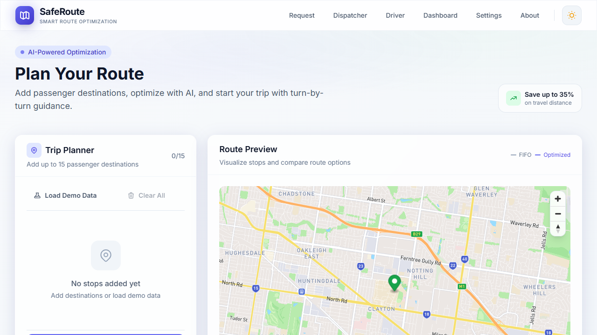
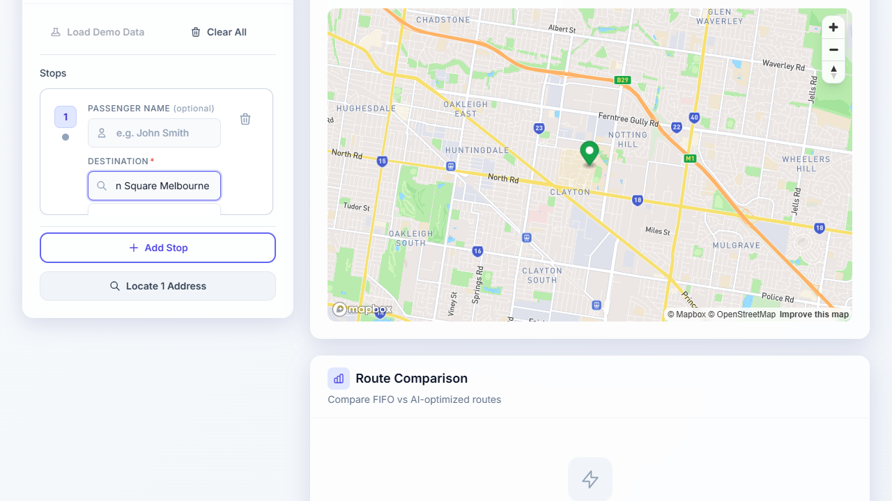
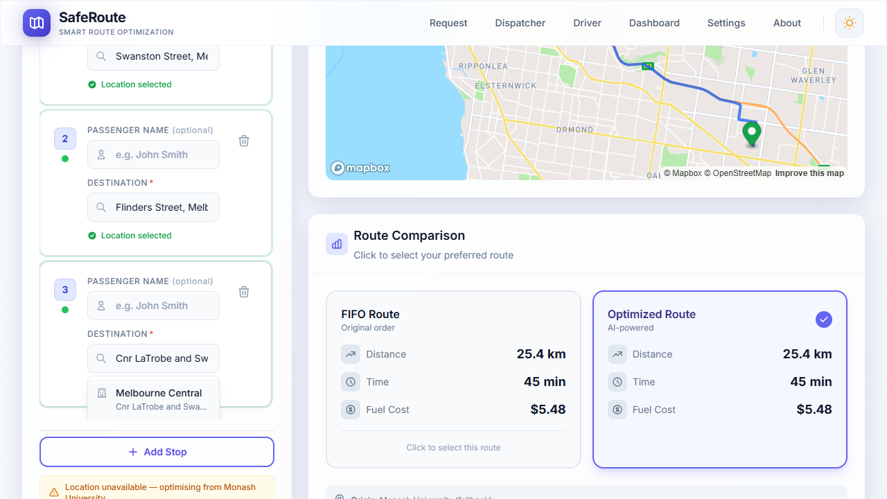
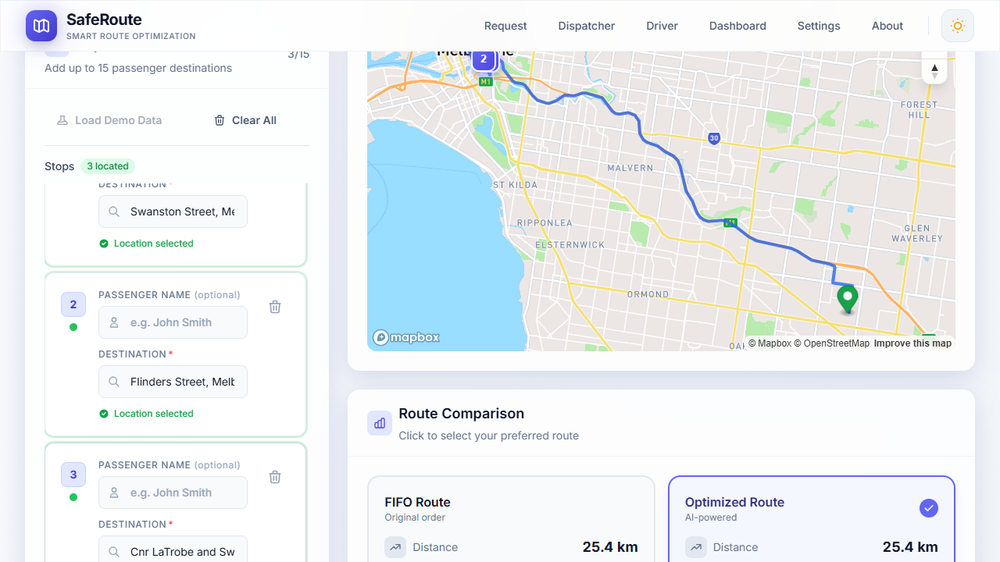
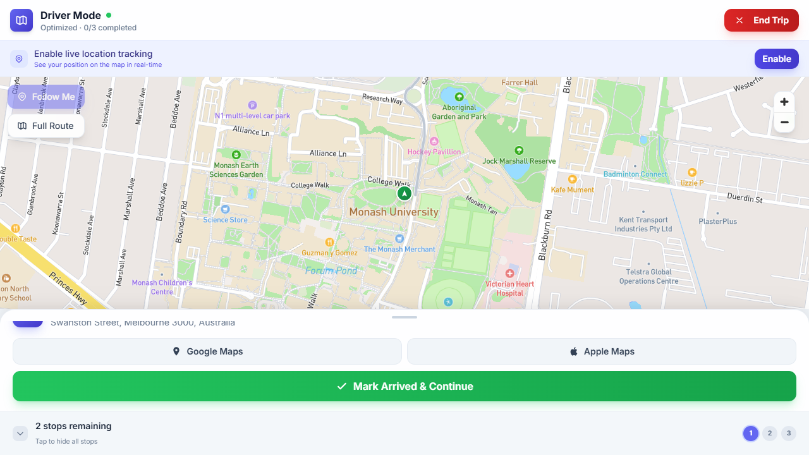
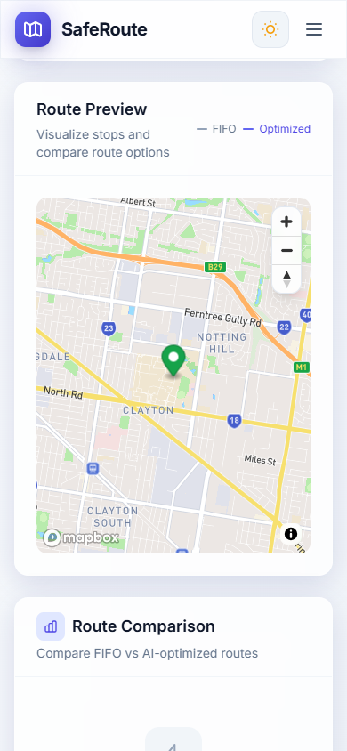
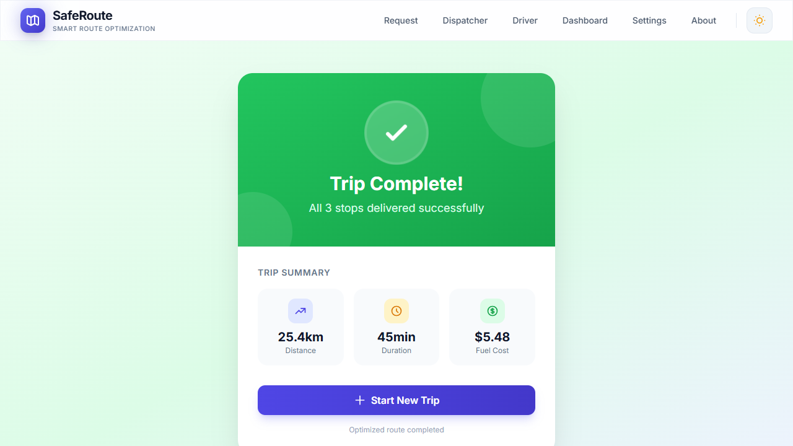
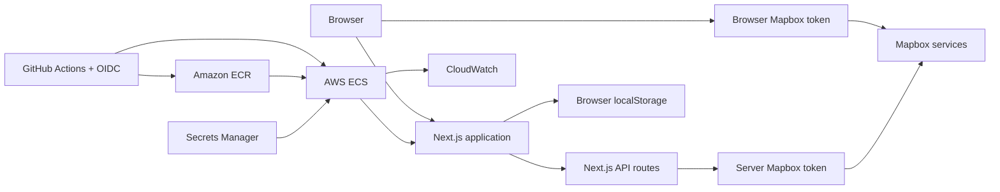

# SafeRoute

Personal proof-of-concept for comparing FIFO drop-off order with a nearest-neighbour heuristic, including driver execution and AWS deployment. Inspired by university security-shuttle route planning. **Not an official Monash University system.**

[](https://github.com/Madhav071204/SafeRoute-Security-Shuttle-Route-Optimisation-System/actions/workflows/ci.yml)

## Overview

SafeRoute is a portfolio application that lets an operator enter passenger destinations, compare **FIFO** (boarding order) with a **nearest-neighbour** reorder, view Mapbox road-route metrics, and run a step-by-step driver mode. Trip state persists in the browser via `localStorage`. The stack is Next.js on Node 22, deployed to AWS ECS with GitHub Actions OIDC.

## Live demonstration

Production (AWS ECS Express Mode, `ap-southeast-2`):

https://sa-2cf22f7190f04affacba88ff88c8e636.ecs.ap-southeast-2.on.aws

Health: `GET /api/health` → `{"status":"ok"}`.

The AWS deployment may later be taken down for cost control. Local Docker and `npm run dev` remain the reproducible demos.

## Screenshots

Production captures (synthetic public Melbourne destinations only):

| Screen | Image |
|--------|-------|
| Trip planning |  |
| Address autocomplete |  |
| FIFO vs optimised |  |
| Map markers and route |  |
| Driver mode |  |
| Mobile layout |  |
| Trip complete |  |

## Problem

Security shuttles often drop passengers in boarding order (FIFO). That order can cause backtracking when destinations are scattered. SafeRoute explores whether a simple nearest-neighbour reorder changes road distance and duration for small stop sets — without claiming operational adoption or guaranteed savings.

## Core features

Verified in production and automated tests:

- Address entry with Mapbox Search Box autocomplete (up to 15 destinations)
- Geocoding via `/api/geocode-batch`
- FIFO vs nearest-neighbour comparison via `/api/optimize` + `/api/route`
- Explicit `routeSource` (`mapbox` or `haversine-fallback`) when road routing is unavailable
- Interactive Mapbox GL map with markers and road polylines
- Driver mode with current stop, upcoming stops, and completion flow
- Browser `localStorage` persistence for trips, dispatch, requests, and settings
- Demo data loader for synthetic addresses
- Configurable fuel-cost *display* estimates (settings-based; not a validated operational model)

## How it works

1. Enter destinations (autocomplete or geocode).
2. Resolve coordinates.
3. Build FIFO order (input order) and nearest-neighbour order (greedy Haversine steps from the origin).
4. Request Mapbox Directions for both orders.
5. Compare distance, duration, and displayed fuel estimate.
6. Select a route and start driver mode.
7. Complete stops until the trip finishes.

## Route optimisation

SafeRoute uses a **nearest-neighbour** heuristic:

1. Start at the origin.
2. Visit the closest unvisited stop (Haversine).
3. Repeat until all stops are visited.

- Approximate complexity **O(n²)** — suitable for at most **15** destinations.
- Does **not** guarantee a globally optimal tour (TSP).
- Ordering uses straight-line distance; displayed metrics use Mapbox road distance/duration when available. A Haversine-preferred order can still be worse on road duration.

## Architecture



More diagrams: [`docs/architecture-diagrams.md`](./docs/architecture-diagrams.md).

## Technology

| Area | Stack |
|------|--------|
| App | Next.js 16.2.x (App Router, standalone), React 19.2.x, TypeScript 6.x |
| UI | Tailwind CSS 3.4.x, Framer Motion 12.x |
| Maps | Mapbox GL JS 3.25.x; Geocoding / Directions / Search Box |
| Runtime | Node.js 22 |
| Tests | Vitest 4.x, Testing Library, Playwright 1.61.x |
| Deploy | Docker (Node 22 slim), Amazon ECR, ECS Express Mode, GitHub Actions OIDC |

## Testing

Verified counts on the release baseline (re-run locally before claiming updates):

| Suite | Count |
|-------|------:|
| Vitest (unit / API / component) | 89 |
| Playwright (local, mocked Mapbox) | 17 |
| Playwright (production smoke / journey) | 5 |

Coverage includes algorithm and API validation, route-source identification, driver E2E flows, and CI enforcement (lint, typecheck, tests, build, Playwright, OIDC deploy on the release branch). Strategy: [`docs/testing-strategy.md`](./docs/testing-strategy.md).

## Deployment and DevOps

- Multi-stage **Docker** image on **Node 22**, non-root user, standalone Next.js output
- Push to **ECR** with **immutable tags** and digest recording
- **ECS Express Mode** service update via **GitHub Actions OIDC** (no long-lived AWS keys in CI)
- Post-deploy **health gate** (`ACTIVE` + `/api/health`)
- **CloudWatch** log group with retention
- Digest-based **rollback** workflow / script
- AWS **budget alerts** configured for cost awareness

Evidence: [`docs/aws-deployment-plan.md`](./docs/aws-deployment-plan.md), [`docs/aws-first-deployment.md`](./docs/aws-first-deployment.md), [`docs/production-acceptance.md`](./docs/production-acceptance.md), [`docs/ci-cd.md`](./docs/ci-cd.md).

## Benchmark results

Six Mapbox road-network scenarios were run on production (2026-07-21). Descriptive summary only:

- Distance shorter for nearest neighbour in **6 / 6** scenarios
- Duration shorter in **5 / 6**; **longer in 1** (duplicate-destination case)
- Median percentage distance difference **16.57%** (range **0.84% … 23.27%**)

Full method, raw table, and limitations: [`docs/route-benchmark-results.md`](./docs/route-benchmark-results.md).

This sample does **not** support marketing claims of typical percentage savings, fuel reduction, or global optimality.

## Security and privacy

- Trip, dispatch, request, and settings data may **persist in browser `localStorage`** across sessions (not session-only).
- Do not enter real passenger or operational data.
- Server Mapbox token lives in **AWS Secrets Manager** (`MAPBOX_ACCESS_TOKEN`).
- Production **public** Mapbox token is origin-restricted to the ECS HTTPS host.
- Container runs as **non-root**; API routes validate inputs before Mapbox calls.
- Residual **Debian base-image** Critical/High CVEs (largely unused Perl packages) are documented in production acceptance — not hidden.
- Proof-of-concept: no authentication, no central database, shared-device risk if `localStorage` is not cleared.

## Known limitations

- No authentication or multi-user access control
- No central database; browser-local persistence only
- Nearest neighbour is not globally optimal
- Haversine ordering can disagree with road-network performance
- Limited six-scenario benchmark sample
- **No formal structured user testing** — owner manual checks and informal peer sharing only; no participant tasks, timings, or surveys
- Not an official operational shuttle system
- Residual third-party / base-image risks remain
- Real-device GPS testing remains limited
- UI marketing copy (for example “save up to 35%”) may still appear in the product chrome; treat documented benchmark results as the evidence base

## Local setup

### Prerequisites

- Node.js 22 (`package.json` engines / `.nvmrc`)
- npm
- Mapbox tokens (see `.env.example`)
- Optional: Docker Desktop for container runs

### Install

```bash
git clone https://github.com/Madhav071204/SafeRoute-Security-Shuttle-Route-Optimisation-System.git
cd SafeRoute-Security-Shuttle-Route-Optimisation-System
npm ci
cp .env.example .env.local
```

Set in `.env.local`:

```text
NEXT_PUBLIC_MAPBOX_TOKEN=your_mapbox_public_token_here
MAPBOX_ACCESS_TOKEN=your_mapbox_server_token_here
```

```bash
npm run dev
```

Open http://localhost:3000.

### Common scripts

```bash
npm run lint
npm run typecheck
npm test
npm run build
npm run test:e2e
npm run test:e2e:production
```

### Docker

See [`docs/docker.md`](./docs/docker.md) and [`docs/docker-deployment-readiness.md`](./docs/docker-deployment-readiness.md). Prefer secure TLS defaults; use `NODE_EXTRA_CA_CERTS` if a proxy requires an approved CA — do not disable TLS verification in production builds.

## Documentation

| Document | Path |
|----------|------|
| Testing strategy | [`docs/testing-strategy.md`](./docs/testing-strategy.md) |
| Runtime audit | [`docs/core-workflow-runtime-audit.md`](./docs/core-workflow-runtime-audit.md) |
| Docker readiness | [`docs/docker-deployment-readiness.md`](./docs/docker-deployment-readiness.md) |
| AWS deployment | [`docs/aws-deployment-plan.md`](./docs/aws-deployment-plan.md) |
| Production acceptance | [`docs/production-acceptance.md`](./docs/production-acceptance.md) |
| Benchmark results | [`docs/route-benchmark-results.md`](./docs/route-benchmark-results.md) |
| User-testing plan | [`docs/user-testing-plan.md`](./docs/user-testing-plan.md) |
| Portfolio case study | [`docs/portfolio-case-study.md`](./docs/portfolio-case-study.md) |
| Demo script | [`docs/demo-script.md`](./docs/demo-script.md) |
| Architecture diagrams | [`docs/architecture-diagrams.md`](./docs/architecture-diagrams.md) |

## Author and licence

- Author: **Ekachit** (repository `package.json` / MIT copyright)
- Licence: **MIT** — see [`LICENSE`](./LICENSE)
- GitHub: [Madhav071204/SafeRoute-Security-Shuttle-Route-Optimisation-System](https://github.com/Madhav071204/SafeRoute-Security-Shuttle-Route-Optimisation-System)

---

Built as a student portfolio proof-of-concept. Not affiliated with Monash University security services.
