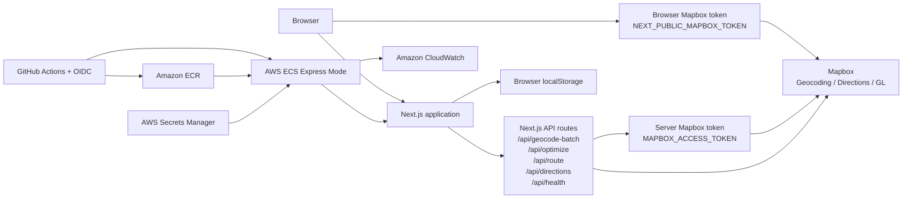
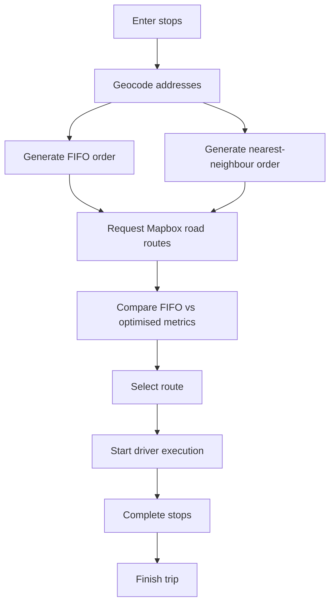
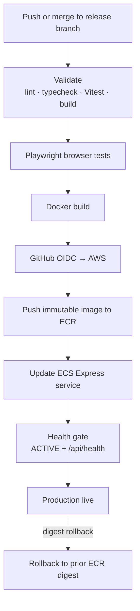

# SafeRoute Architecture Diagrams

Editable Mermaid diagrams for portfolio and GitHub rendering.

## System architecture

```mermaid
flowchart LR
  Browser["Browser"]
  NextApp["Next.js application"]
  PublicToken["Browser Mapbox token<br/>NEXT_PUBLIC_MAPBOX_TOKEN"]
  ApiRoutes["Next.js API routes<br/>/api/geocode-batch<br/>/api/optimize<br/>/api/route<br/>/api/directions<br/>/api/health"]
  ServerToken["Server Mapbox token<br/>MAPBOX_ACCESS_TOKEN"]
  Mapbox["Mapbox<br/>Geocoding / Directions / GL"]
  LocalStorage["Browser localStorage"]
  ECS["AWS ECS Express Mode"]
  ECR["Amazon ECR"]
  Secrets["AWS Secrets Manager"]
  CW["Amazon CloudWatch"]
  GHA["GitHub Actions + OIDC"]

  Browser --> NextApp
  Browser --> PublicToken
  PublicToken --> Mapbox
  NextApp --> ApiRoutes
  NextApp --> LocalStorage
  ApiRoutes --> ServerToken
  ServerToken --> Mapbox
  ApiRoutes --> Mapbox
  GHA --> ECR
  GHA --> ECS
  ECR --> ECS
  Secrets --> ECS
  ECS --> NextApp
  ECS --> CW
```

## Core workflow

```mermaid
flowchart TD
  A["Enter stops"] --> B["Geocode addresses"]
  B --> C["Generate FIFO order"]
  B --> D["Generate nearest-neighbour order"]
  C --> E["Request Mapbox road routes"]
  D --> E
  E --> F["Compare FIFO vs optimised metrics"]
  F --> G["Select route"]
  G --> H["Start driver execution"]
  H --> I["Complete stops"]
  I --> J["Finish trip"]
```

## Deployment

```mermaid
flowchart TD
  Push["Push or merge to release branch"] --> Validate["Validate<br/>lint · typecheck · Vitest · build"]
  Validate --> PW["Playwright browser tests"]
  PW --> Build["Docker build"]
  Build --> OIDC["GitHub OIDC → AWS"]
  OIDC --> ECR["Push immutable image to ECR"]
  ECR --> ECS["Update ECS Express service"]
  ECS --> Health["Health gate<br/>ACTIVE + /api/health"]
  Health --> Live["Production live"]
  Live -.->|"digest rollback"| Rollback["Rollback to prior ECR digest"]
```
